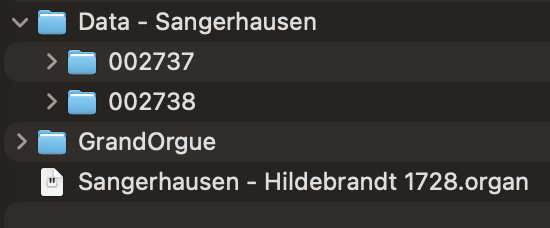

# SangerhausenODFforGrandOrgue
Sangerhausen ODF for GrandOrgue

## Overview

Sonus Paradisi offers a [sample set for Hauptwerk](https://www.sonusparadisi.cz/en/organs/germany/sangerhausen-zacharias-hildebrandt-organ.html) of the organ of the Jacobikirche, Sangerhausen. "It was built by Zacharias Hildebrandt (1688-1757), who was a pupil of G. Silbermann and a contemporary of Johann Sebastian Bach.". Hence the sample set is very useful to practise works of masters of that time.

In this repository you'll find an organ definition file (ODF) and additional files so you can use the sample set with [Grand Orgue](https://github.com/GrandOrgue/grandorgue). It has initially been derived from the Hauptwerk ODF by using [OdfEdit](https://github.com/GrandOrgue/OdfEdit). I removed the left and right jambs (since I only use one touch screen). Since the RAM of my machine can't cope with the full surround sample set, I disabled the rear channel samples and as a consequence, removed the channel mixer panel.

## Installation

* Purchase the [sample set for Hauptwerk](https://www.sonusparadisi.cz/en/organs/germany/sangerhausen-zacharias-hildebrandt-organ.html) and install it either using Hauptwerk or extract the archives manually (you'll need the two folders 002737 and 002738).

* [Download](https://github.com/GrandOrgue/grandorgue/releases) and install GrandOrgue.

* [Download](https://github.com/Christedge/SangerhausenODFforGrandOrgue) this release and extract it.

* Put all the extracted files in one place. The required structure is as follows:
  
  * Data - Sangerhausen
    * 002737
    * 002738
  * GrandOrgue
  * Sangerhausen - Hildebrandt 1728.organ

 

* Ensure your MIDI keyboard is connected to your computer.

* Start GrandOrgue

* Press the key »O« and select the file »Palma - Caimari 1702.organ«. The sample set will be loaded.

* From the menu »Window« choose »Zoom« so as to ensure the main panel fills the whole screen (you may want to repeat this step for any further panels you open).

* Right click (or hold the Ctrl key and klick) on one of the keybeds. Klick the button »Wait for Event«, then press a key on your key- respectively pedalboard, then confirm the dialog.

* From the menu »File« choose »Save« so that the assignment is still present after the next start.

* Optionally open further panels (e.g. the Simple Jamb) to figure out which one suits your needs best.

* Enjoy :) .
